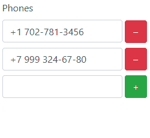

ArrayField
===========

The extension build a form field for array attribute of a model.

If you have array attributes in a model you can edit them using the extension.

[](https://travis-ci.org/Tigrov/yii2-array-field)

It requires to use `Bootstrap` library.

Installation
------------

The preferred way to install this extension is through [composer](http://getcomposer.org/download/).

Either run

```
php composer.phar require --prefer-dist tigrov/yii2-array-field
```

or add

```
"tigrov/yii2-array-field": "~1.0"
```

to the require section of your `composer.json` file.

Usage
-----

Specify class `ArrayField` for a form field.

```
<?php $form = ActiveForm::begin(); ?>
    ...
    <?= $form->field($model, 'phones', ['class' => ArrayField::class]) ?>
    ...
<?php $form::end(); ?>
```

`$model->phones` must be an array.

You can see the result



License
-------

[MIT](LICENSE)
